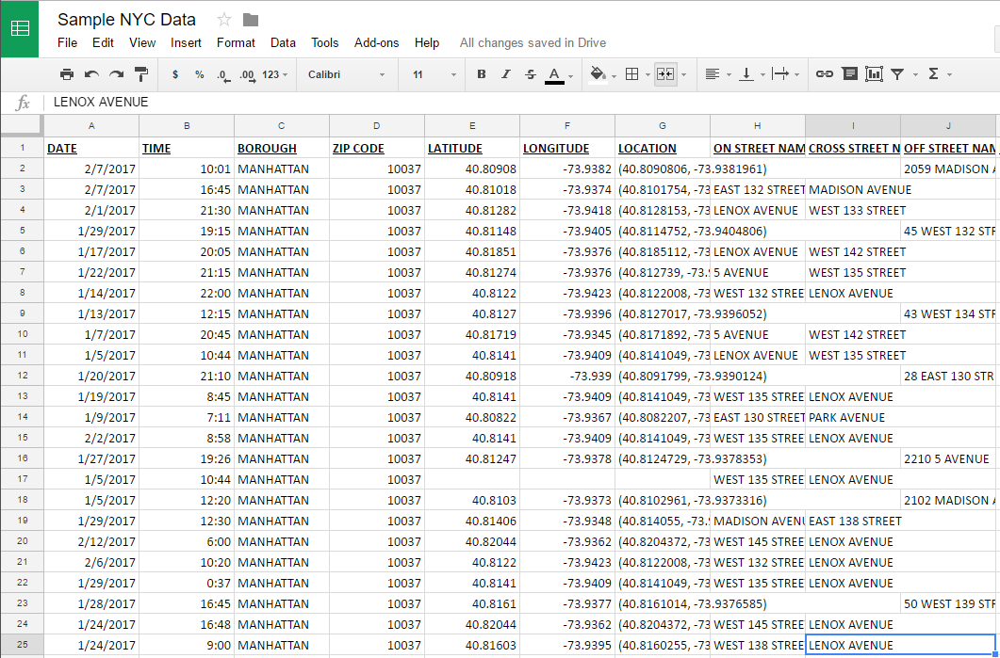

# Working with Data

Most of the time, when you get data, it's going to come in either **spreadsheet** or **pdf** form. Spreadsheets are the preferred way, because it's easy to take spreadsheet data and turn it into charts and web projects.

- **Tip**: When trying to download data, look for files that end in **.xls**, **.xlsx**, **.csv**, or **tsv**.

Once you've got a file, you can open it up [Google Sheets](https://sheets.google.com), which is free and absolutely fantastic for making sense of data. *We'll be working in Google Sheets from here on out.*

## Don't be afraid of spreadsheets!

I know, they look intimidating and they make you want to fall alseep, but they're actually a very orderly way to keep track of large amounts of information.

So let's take a look at a typical spreadsheet:

[Today's worksheet](http://bit.ly/2lm1G9y). Open it, then select **File > Make a Copy** to create a copy for yourself. 

(Microsoft Excel looks generally the same)

There are a couple of key concepts to know when it comes to spreadsheets.

- A vertical line of boxes is called a **column**. (You know, like columns in a building.)
  - Columns are identified by the letter above the first square. (So the first column is named A, the second is named B, and so on.)
- A horizontal line of boxes is called a **row**.
  - Rows are identified by the number in the right left corner. So the first row is 1, the second is 2.
- Each little spreadsheet box is called a **cell.** Cells each have their own unique ID number that comes from the **Column Letter** and the **Row Number**. So the very first cell is named A1. The one to the right of it is named B1. The one below A1 is A2.
- Little section below the toolbar is called the **Formula Bar**. It displays the contents of the cell you've clicked, and it's also where you can write **functions,** which are awesome little commands that you can use to do cool things to the information in your spreadsheet.

## Let's get started

