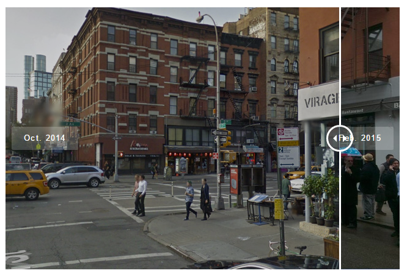
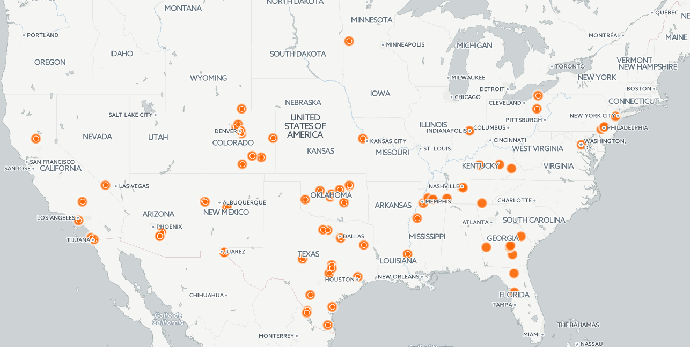

# NND1 Data Session 2: Visualizing Data

### AKA: The fun part of data journalism

Okay, so we've <a href="../../readme.md" target="blank">gotten our hands on some data</a> and done the hard work of <a href="../02-16-17/readme.md" target="blank">cleaning it in Excel or Google Sheets</a>. Now it's time to turn it into something digestible for readers.

On today's web, the most common way to show numerical data is to put it into either a <a href="http://www.marketwatch.com/story/uniteds-stock-is-set-to-fall-5-and-wipe-1-billion-off-the-airlines-market-cap-2017-04-11?mod=cx_picks_pol&cx_navSource=cx_picks_pol&cx_tag=other&cx_artPos=6#cxrecs_s" target="blank">chart</a>, a <a href="https://www.nytimes.com/interactive/2016/04/19/us/elections/new-york-city-democratic-primary-results.html">map</a>, or a <a href="https://fivethirtyeight.com/features/the-case-for-lebron-james-mvp/" target="blank">datatable</a>, and there are lots of free tools to make these very quickly.

And if your data isn't numerical (let's say you've got a bunch of photographs, or audio or text), that's cool tool, there are great tools for those types of things as well.

Today we're going to:

- Build a chart with Datawrapper
- Make a map story with Storymap.js
- Create a before/after slider with Juxstapose.js
- Get a quick introduction to data maps with Carto, audio embeds with Soundcite.js, and timelines with Timeline.js

# [Datawrapper](https://www.datawrapper.de/)

This is a freemium tool that lets you build bar charts, pie charts, data tables, and country-level maps.
- It's very easy to use. All you do is copy and paste in data from your spreadsheet and it will walk you through the steps to produce your chart or graphic.
- When you're finished, Datawrapper gives you an *embed code* (a chunk of web code) that will let you display the graphic on a website.
**Demo time**: Using datawrapper, let's create a bar graph of Harlem public school math test scores.
- <a href="https://docs.google.com/spreadsheets/d/1dSWvcsL4Z5xagqCcVUK_A2LSGj5WDnX_-PqPtsUktwg/edit?usp=sharing" target="blank">Test Scores Spreadsheet</a>

# [StorymapJS](https://storymap.knightlab.com/)

[Example](https://www.dnainfo.com/new-york/20160919/chelsea/timeline-how-ahman-khan-rahami-was-found)
Storymap is a totally free website that lets you mark locations on a map and give a description about the location. The user then clicks through the map location by location.
- You can include video and images in the description.
- Is connected to your Google account, so you can come back and edit your Storymap later.
- When you're finished, you can either send users to the map itself, or you can get an embed code and display it on your site. 
**Demo Time**: Create a storymap showing anything you want. 

# [JuxtaposeJS](https://juxtapose.knightlab.com/)

[Example](https://www.dnainfo.com/new-york/20150326/east-village/massive-explosion-rips-through-east-village-building)
This free tool does one thing: it takes two images and puts them on top of each other so that readers can compare them by swiping back and forth. 
- Great for showing a dramatic or subtle change
- This is most often used for before-and-after comparisons of the same location.
- When you're finished, Juxstapose gives you an embed code.
- 
**Demo time**: I've got a photoshop of a cat that's wearing a hat. Copy the two hyperlinks below and use them to create a slider of the cat with and without the hat.

Before: https://github.com/seenigel/dataviz-toolkit/blob/master/data/image-slider/cat_left.jpg
After: https://github.com/seenigel/dataviz-toolkit/blob/master/data/image-slider/cat_right.jpg

Other tools
# [TimelineJS](https://timeline.knightlab.com/)

[Example](https://www.dnainfo.com/new-york/20160826/jamaica/timeline-look-back-at-century-old-elmhurst-dairy-before-it-closes)
This tool creates timelines that use user can step through. You can include photos and even videos from YouTube. It's powered by a Google spreadsheet, so you can even work on it anywhere.
- Powered by Google spreadsheets, but has step-by-step directions.

# [Carto](https://carto.com/)

Carto is a website that lets you take data with geographic data (latitude and longitude coordinates) and plot them on a map.
- Has a steeper learning curve, but is very powerful
- We don't have time to get into it today, but my friend CJ Sinner at the Minneapolis Star Tribune put together a [great tips sheet on it](https://docs.google.com/document/d/145BMLYolq7VR2QIE_9s2SZ84ShgTHGKmyCr8pP-sXpo/edit).

# [SoundciteJS](http://soundcite.knightlab.com/)
This is a free tool that lets you embed a sound clip inside text. The user then hears the audio when they click. (Think of it like a hyperlink for sound.)

