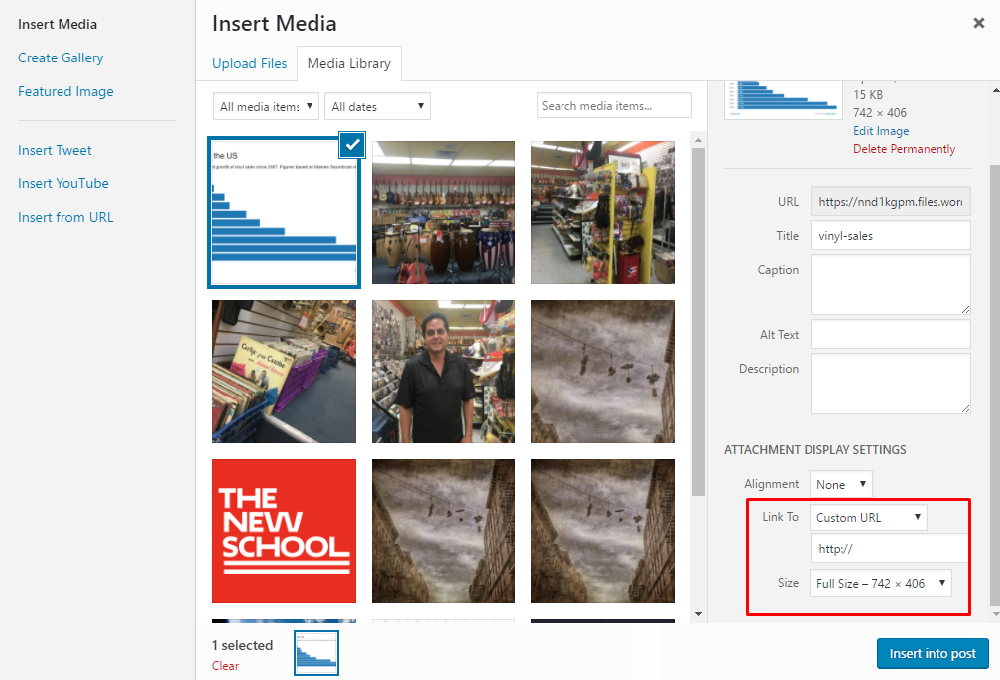

# Embeds and Wordpress.com Sites
 
 A few students have been having trouble getting charts to display on the class site. This is because websites hosted by wordpress.com <a href="https://en.support.wordpress.com/code/" target="blank">don't allow iframes for security reasons.</a>
 
 This is a bit of a bummer, but we can work around the limitation by posting a screenshot of the project and having it hyperlink to the real project when the user clicks on it. Here's how to take a screenshot of your project:
 
 ### On a Mac
 After you've finished creating your interactive, press **command + shift + 4** on a Mac. Your mouse cursor will turn into a little cross and allow you to highlight the section of your screen that you'd like to save as a screenshot. When you finish dragging, the screenshot will be saved to your desktop.
 
 ### On a PC
 Open the start menu and in search type **Snipping Tool** and launch the snipping tool app. Click new, and then drag the cursor around the section of your screen that you'd like to save. You should see a preview of the screenshot. Once it appears, click **File > Save As** and save the screenshot.
 
 ##  Uploading and Hyperlinking
 
 Once you've got your screenshot save, go to the Wordpress post area and find the section of your story where you'd like to display the graphic.
 
 - Click "Add Media", then click "Upload Files"
 - Drag and Drop the screenshot you just took.
 - In Attachment Display Options, set **Link to** to **Custom URL**
 - In the URL field, enter the **direct link** to your graphic. 
 - Click *Add to Post*

