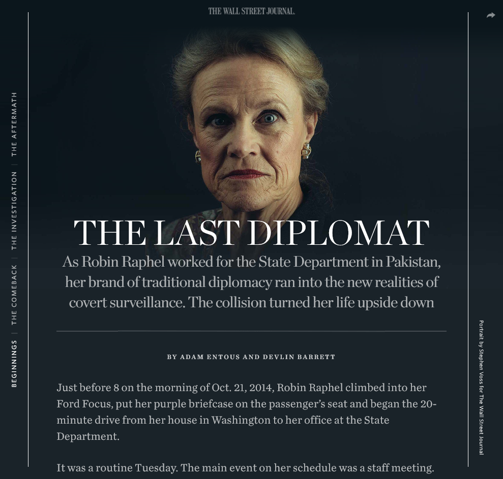
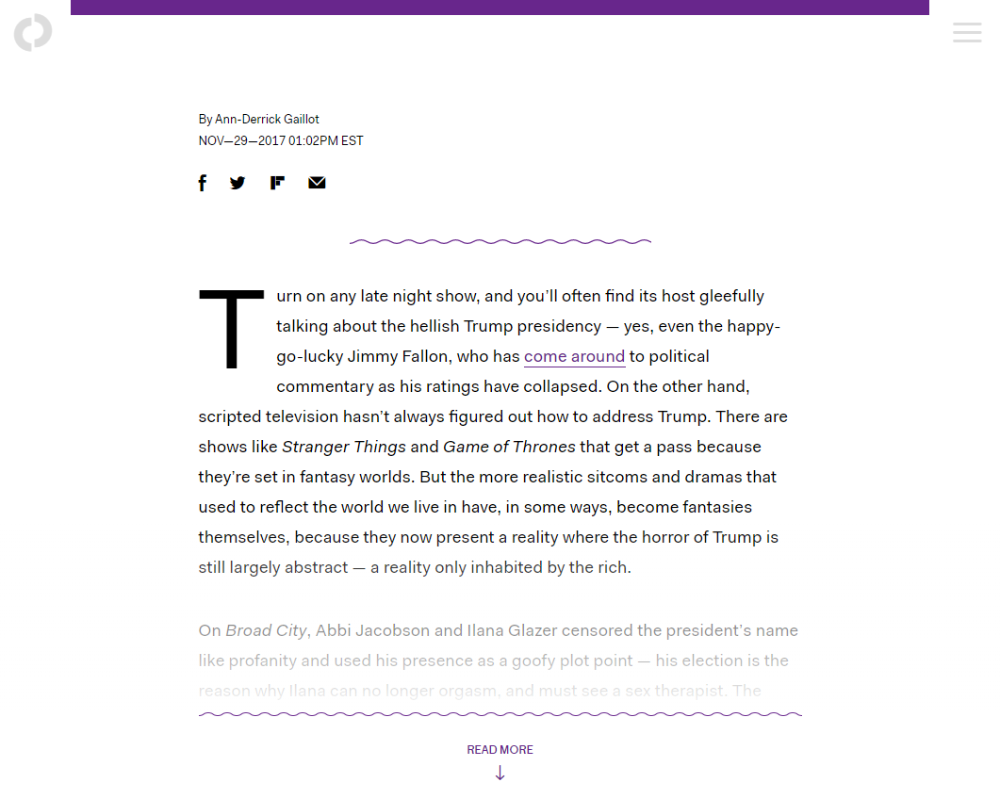
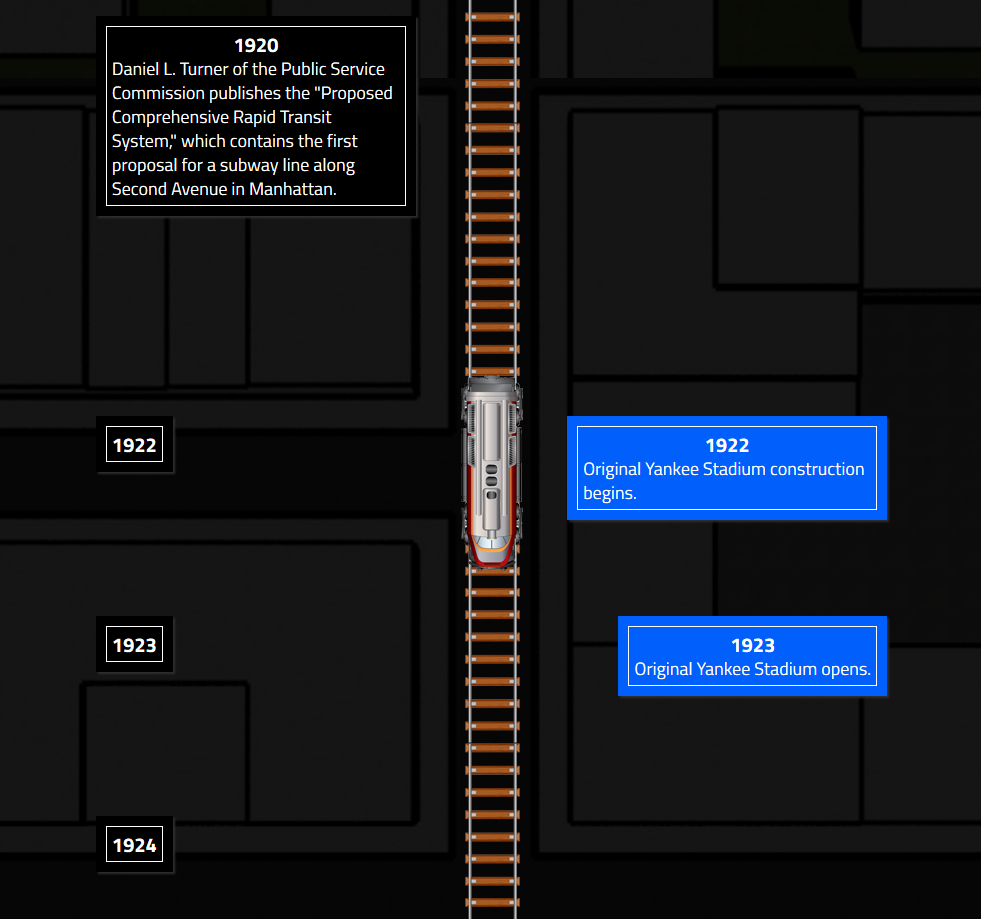
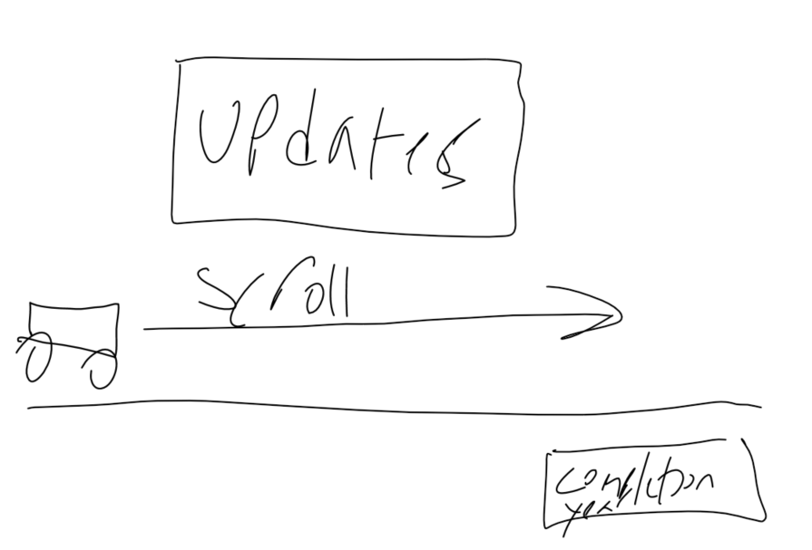
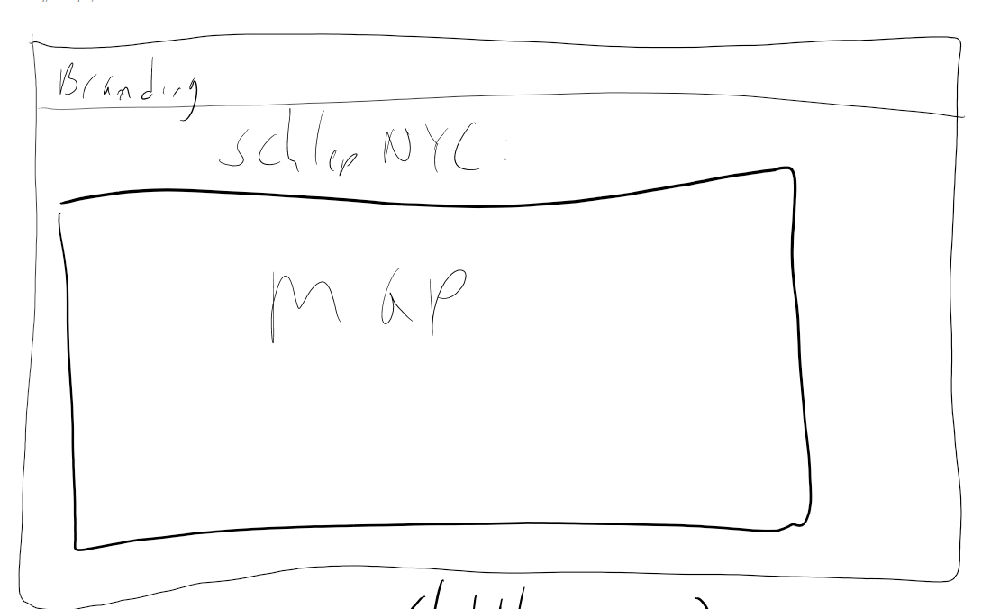
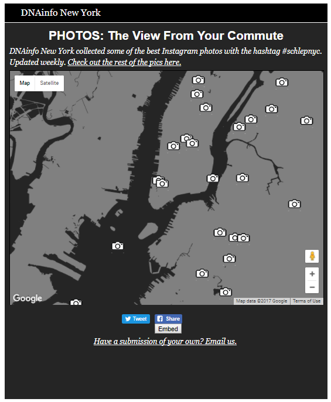

# NND: Designing for News
**AKA: You did all this great reporting, now let's make sure that people read it.**

Permalink to today's notes: 

Okay, so you're getting to the end of the semester! You've learned how to identify newsworthy events, how to talk to sources, how to find data, how to analyze it and how to visualize it. Today we're going to talk about designing for news.

## What does it mean to design for news?

Today's internet is a fairly uniform place. Most websites look the same. Which means most news stories visually look the same. (Don't believe me? Check out this gif I made.)

Because of this, one of the most effective ways to help your story get read is to package it in a unique, different, or attractive way.

## Examples

 - <a href=
https://t.co/Ayzh57Frk6
 target="blank">**The Last Diplomat**</a> (Wall Street Journal): This is a harrowing story about a diplomat who was accused of being a spy. It's a great story, and it's packaged in way that screams: "this is important."
   - The sidebar is gone, even on desktop, so the story takes up the full width of the screen. 
   - The background is black, which tells readers this is a serious or somber story.
   - There are big photos, which help draw the reader in.
   - On desktop, there are chapter titles that run along the left side, which helps give the reader a sense of place.

 Long story short, this page is designed to cut out distractions and let the reader focus on the story.

- <a href="https://theoutline.com/post/2513/is-soup-a-beverage-or-a-food" target="blank">The Outline</a> (The Outline): Remember how I said that most news sites look the same? The Outline is a strong outlier. It takes all of the norms of news websites and throws them in the wastebasket. There's no menu running across the top of the site. There's no sidebar. The ads are integrated into the page. The text stands in sharp contrast from the background of the story. Again, this is designed to get you to do one thing: read the story.

- **<a href="https://editorial-ny.dnainfo.com/interactives/2015/06/subway-history/index.html" target="blank">The Subway That Time Forgot</a>** (DNAinfo): This project could have easliy been a timeline made with TimelineJS. The premise is simple enough: In the time it took the MTA to build the 2nd Ave Subway, lots of other NYC landmarks were built, destoryed, and built again. But I wanted to drive that home to the reader, so I designed a page that:
  - **Intentionally** made the reader scroll for a long time. I decided pretty early on that I wanted to convey time through scrolling, and I wanted the reader to get a sense of "jeez, when is this going to end?" (Because that's how we all felt about the subway.) Note: long scrolling is a risky move on desktop, where users might have to click a thousand times, or move a trackpad or turn a wheel on a mouse. It's less risky on mobile, where users are used to scrolling through lists.
  - Made the contrast between subway developments and other developments clear.
  - Took the user on a journey. I wanted this to be an experience.

## Getting Started

Think about your story. Think about it in its most simple premise. Then think about how you want readers to experience it.
  - Do you want to lean back and read it like they're reading a book? Maybe think about making the text big and getting rid of distractions.
  - Are the photos the best part of your story? The absolute best part? Make them prominent.
  - Do you want readers to interact with the story in some way? Make it clear to them.
  - Think about **when** your story will be useful to readers. Is it something they should experience? Will it be relevant on the go?
  - Think about the medium it will be delivered in: go beyond desktop (pretty please) and think about phones and tablets, think about social media, and think about email (remember email? It's back!)

## Now Draw
One of the best ways to turn an idea into someone concrete is to draw it. That way you can get your thoughts down, experiment with ideas, and refine it until you've got something you like.

For the Subway that Time Forgot, here was my first sketch:

- Things changed from the first drawing to the final produt, but you can see that the idea remained consistent.

I actually sketch out projects all the time. Here's another early sketch, and the final project.

That last sketch, with boxes and labels, is called is a **wireframe**. It's a common way of mocking up a webpage so that you can get a sense of what your content is looks like and tweak it as you go along. You can do with pencil or paper, Microsoft Paint, or any of a thousand different wireframing websites. 

- They can be crude, or if your idea is pretty far along, they can be close to the final product.

## Remember to think about the medium!

I said that before, but it bears repeating: you have to keep in mind how your story is being read, because people read differently on different devices and at different times:

- Desktop: Most readership here tends to be in from 9-5. Readers tend to skim headlines, and maybe read the first paragraph. (Which makes sense. They might be at work,)
- Mobile: Readership on mobile devices is strong all the time, but most strong during morning commutes, at lunch time, at night. Here, you're competing with SnapChat and Instagram for attention, so if you've got a point to make, make it quick.
- Tablet: Tablets tend to be more of a lean back experience, and its greatest for reading at nights and on weekends. This means you can give tablet readers more of a book-like or magazine-like experience.
- Social Media: Readers usually skim headlines. A striking photo or graphic can get them to stop in their tracks.

## Further Reading:
- <a href=" http://www.slate.com/articles/technology/technology/2013/06/how_people_read_online_why_you_won_t_finish_this_article.html" target="blank">Slate: Why you won't finish this article</a> - This is a great piece that explains why its important for us to think out of the box when it comes to news delivery. TL;DR: Most people don't read for a long time.
- <a href="http://gs.statcounter.com/press/mobile-and-tablet-internet-usage-exceeds-desktop-for-first-time-worldwide">Stat Counter: Mobile and tablet internet usage exceeds desktop</a> - The shift from print to digital is complete. A second shift, from desktop computers to phones and tablets, is underway. So when designing for news, prioritize those.
- <a href="https://www.doublemesh.com/free-wireframing-tools/" target="blank">30 Free Wireframing Tools</a> - To get you started with sketching.
- <a href="http://www.onenote.com/" tagget="blank">Microsoft OneNote:</a> A free app for Desktop, Mobile and the Web that I use for all of my sketching and planning
