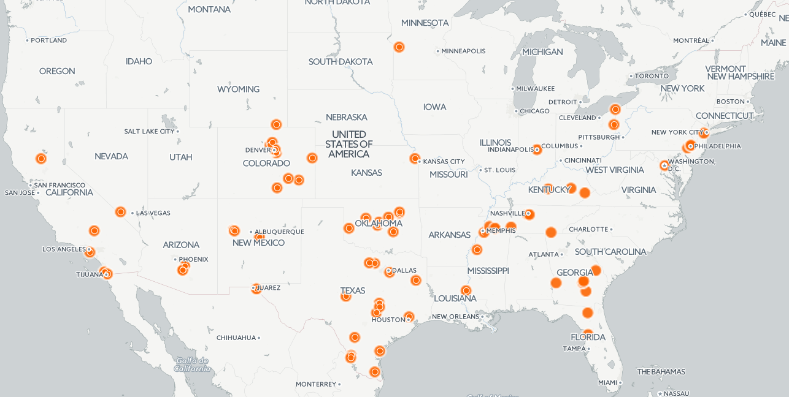

#NND1: Doing More With Data

### AKA: The fun part of data journalism

Okay, so we've <a href="../readme.md" target="blank">gotten our hands on some data</a> and done the hard work of <a href="../analysis/readme.md" target="blank">cleaning it in Excel or Google Sheets</a>. Now it's time to turn it into something digestible for readers. 

# Charts!

Most of the time, if you've got numerical information, the most straightforward way to turn it into a chart. What kind of chart depends on what kind of information you have and what it represents.

- If you're comparing whole numbers or parts of a whole (like iPhones sold each year for the last three years or percentage of each racial group in Fort Greene, Brooklyn): You should use a **bar chart**

- If you're comparing ratios or rates over time (like the median rent in Brooklyn over time): You should use a **line chart**

- If you're trying to show the parts of a whole, you can (but you really shouldn't) use a **pie chart**

- If you're trying to show how two (or even three) sets of numbers relate to each other, you can use a **scatterplot**

- And if all else fails, you can put the information in **datatable**

# Let's Make Some Charts

Microsoft Excel and Google sheets both have built-in chart making tools, but today we'll be using **Datawrapper**, a website built for beginners that lets you make bar charts, pie charts, data tables, and country-level maps.
- It's very easy to use. All you do is copy and paste in data from your spreadsheet and it will walk you through the steps to produce your chart or graphic.
- When you're finished, Datawrapper gives you a link to the chart that you can then put in your story. (And if you're super fancy, you can take a screenshot of the chart and hyperlink **that**.)

**Demo time**: Using datawrapper, let's create a bar graph of rodent complaints by zip code and a line graph of median rents in NYC boroughs since 2012.
- <a href="https://www.datawrapper.de" target="blank">Datawrapper Website</a>
- <a href="https://docs.google.com/spreadsheets/d/1W5cYR7_q62ZahBCikfJ3rYe4Dsdb-eAp0pXImPRmNg0/edit?usp=sharing" target="blank">Sample Data</a>
- Datawrapper asks you to make an account, but for now you can use my dummy account. **username:** nnddata@gmail.com, **password**: dataisgreat

##  When charts won't cut it
If your data isn't numerical (let's say you've got a bunch of photographs, or audio or text), that's cool too, there are great tools for those types of things as well. Today I'm going to show you how to:

- Make a map story with Storymap.js
- Create a before/after slider with Juxstapose.js

# [StorymapJS](https://storymap.knightlab.com/)

[Example](https://www.dnainfo.com/new-york/20160919/chelsea/timeline-how-ahman-khan-rahami-was-found)

Storymap is a totally free website that lets you mark locations on a map and give a description about the location. The user then clicks through the map location by location.
- You can include video and images in the description.
- Is connected to your Google account, so you can come back and edit your Storymap later.
- When you're finished, you can either send users to the map itself, or you can get an embed code and display it on your site. 
**Demo Time**: Create a storymap showing anything you want. 

# [JuxtaposeJS](https://juxtapose.knightlab.com/)

[Example](https://www.dnainfo.com/new-york/20150326/east-village/massive-explosion-rips-through-east-village-building)

This free tool does one thing: it takes two images and puts them on top of each other so that readers can compare them by swiping back and forth. 
- Great for showing a dramatic or subtle change
- This is most often used for before-and-after comparisons of the same location.
- When you're finished, Juxstapose gives you a link to the slider.

**Demo time**: I've got a photoshop of a cat that's wearing a hat. Copy the two hyperlinks below and use them to create a slider of the cat with and without the hat.

- Before: http://www.nigelchiwaya.com/wp-content/uploads/2017/04/cat_left.jpg
- After: http://www.nigelchiwaya.com/wp-content/uploads/2017/04/cat_right.jpg

Other tools
# [TimelineJS](https://timeline.knightlab.com/)

[Example](https://www.dnainfo.com/new-york/20160826/jamaica/timeline-look-back-at-century-old-elmhurst-dairy-before-it-closes)

This tool creates timelines that use user can step through. You can include photos and even videos from YouTube. It's powered by a Google spreadsheet, so you can even work on it anywhere.
- Powered by Google spreadsheets, but has step-by-step directions.

# [Carto](https://carto.com/)

Carto is a website that lets you take data with geographic data (latitude and longitude coordinates) and plot them on a map.
- Has a steeper learning curve, but is very powerful
- We don't have time to get into it today, but my friend CJ Sinner at the Minneapolis Star Tribune put together a [great tips sheet on it](https://docs.google.com/document/d/145BMLYolq7VR2QIE_9s2SZ84ShgTHGKmyCr8pP-sXpo/edit).

# [SoundciteJS](http://soundcite.knightlab.com/)

This is a free tool that lets you embed a sound clip inside text. The user then hears the audio when they click. (Think of it like a hyperlink for sound.) 

## To Wrap Up
- Think about what type of information you have, and think what's the best way to show it. (Sometimes the best way is to just put it in the text of the story!)
- You don't have to limit yourself to numbers. Remember that data is transcripts, data is photographs, data is locations.

## What's Next?

So now you've got the basics on how to analyze and visualize information. But we still need to think about what's the best way to present your story. (Because mobile readers might not want to scroll through really long lists, and desktop users never want to pan sideways.)

Next month you're going to learn to start thinking like a news designer.