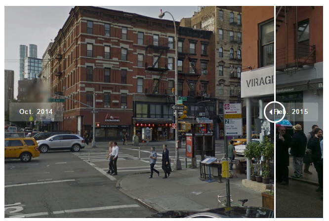

# NND1 News Design
http://bit.ly/nnd1-newsdesign

Okay, in previous sessions we've established how data and public records can enhance your reporting and we've analyzed data to find stories in numbers. Today we're taking a break from numbers to talk about another important aspect of news: story design.

**Session 1:** https://github.com/seenigel/NND1/tree/master/spring-2018/

**Session 2:** https://github.com/seenigel/NND1/tree/master/spring-2018/session2

## Question time:
Here are two front pages from Sept. 12, 2001, the day after the World Trade Center in New York was destroyed in a terrorist attack. 

- <a href="https://i.pinimg.com/736x/2b/ca/3b/2bca3bddd0867ba928075f446b505d7c.jpg" target="blank">The Wall Street Journal</a>
- <a href="https://archive.nytimes.com/screenshots/www.nytimes.com/packages/html/nyregion/9-11imagemap.jpg" target="blank">The New York Times</a>

Which front page is more likely to grab your attention? Why?

Here's a more recent example, showing the movements of a man infected with the ebola virus around New York City.
- <a href="http://www.nydailynews.com/new-york/ebola-patient-dr-craig-spencer-city-timeline-article-1.1986708" target="blank">New York Daily News</a>
- <a href="https://www.nytimes.com/interactive/2014/10/23/nyregion/new-york-city-ebola-patient-timeline-map.html" target="blank">New York Times</a>

Which story is easier to understand? Why?

*Story design is about determining the strongest or most important part of your story and presenting it to readers in a clearly accessible or memorable way.*

## Why should you care?
Because it doesn't matter how well-reported your story is, the way it's presented will make the difference between whether it gets read, talked about, and shared on social media, and whether it gets clicked away from.

## So how do you figure out what's the strongest part of your story?
You'll kind of know it from your reporting. It's the part of the story that you can see people sharing on Twitter, or calling a friend over to look at. It's that one great quote, or the amazing photograph. It's that one key statistic.

If you can't figure it out, just ask yourself: "What's the point of the my story? What do I really want people to know?" That will lead you in the right direction.

Another example: 
- <a href="http://www.dnainfo.com/new-york/20150316/far-rockaway/are-you-chronically-late-try-our-mayor-de-blasio-lateness-excuse-generator/" target="blank">DNAinfo Mayoral Excuse Machine</a>
- The point we wanted to show with this story was that the mayor had a bunch of excuses for being late.

Once you're figured out what your strongest element is, now you can think about how to present it.

- If your strongest element is a quote, you can use a **pull quote**.

- If you strongest element is a photo, make that photo large and place it prominently in the story.

- If your strongest element is a bunch of data, put it into a **chart**.

- If it's a bunch of locations, **put them on a map**.

## More on Charts

Most of the time, if you've got numerical information, the most straightforward way to turn it into a chart. What kind of chart depends on what kind of information you have and what it represents.

- If you're comparing whole numbers or parts of a whole (like iPhones sold each year for the last three years or percentage of each racial group in Fort Greene, Brooklyn): You should use a **bar chart**

- If you're comparing ratios or rates over time (like the median rent in Brooklyn over time): You should use a **line chart**

- If you're trying to show the parts of a whole, you can (but you really shouldn't) use a **pie chart**

- If you're trying to show how two (or even three) sets of numbers relate to each other, you can use a **scatterplot**

- And if all else fails, you can put the information in **datatable**

# Tools
## Datawrapper 
-https://datawrapper.de

- *Datawrapper** is a website built for beginners that lets you make bar charts, pie charts, data tables, and country-level maps.

- It's very easy to use. All you do is copy and paste in data from your spreadsheet and it will walk you through the steps to produce your chart or graphic.
- When you're finished, Datawrapper gives you a link to the chart that you can then put in your story. (And if you're super fancy, you can take a screenshot of the chart and hyperlink **that**.)
- Datawrapper asks you to make an account, but for now you can use my dummy account. **username:** nnddata@gmail.com, **password**: dataisgreat

##  When charts won't cut it
If your data isn't numerical (let's say you've got a bunch of photographs, or audio or text), that's cool too, there are great tools for those types of things as well. Today I'm going to show you how to:

- Make a map story with Storymap.js
- Create a before/after slider with Juxstapose.js

## StorymapJS 
- https://storymap.knightlab.com/

[Example](https://www.dnainfo.com/new-york/20160919/chelsea/timeline-how-ahman-khan-rahami-was-found)

Storymap is a totally free website that lets you mark locations on a map and give a description about the location. The user then clicks through the map location by location.
- You can include video and images in the description.
- Is connected to your Google account, so you can come back and edit your Storymap later.
- When you're finished, you can either send users to the map itself, or you can get an embed code and display it on your site. 
**Demo Time**: Create a storymap showing anything you want. 

## JuxtaposeJS:

-  https://juxtapose.knightlab.com/

**Examples:** 
- https://www.theverge.com/2018/3/30/17179642/huawei-p20-pro-vs-pixel-2-xl-camera-comparison-low-light
- https://www.dnainfo.com/new-york/20160304/hells-kitchen-clinton/public-plaza-owned-by-luxury-complex-needs-makeover-architect-says/

This free tool does one thing: it takes two images and puts them on top of each other so that readers can compare them by swiping back and forth. 
- Great for showing a dramatic or subtle change
- This is most often used for before-and-after comparisons of the same location.
- When you're finished, Juxstapose gives you a link to the slider.

**Demo time**: I've got a photoshop of a cat that's wearing a hat. Copy the two hyperlinks below and use them to create a slider of the cat with and without the hat.

- Before: http://www.nigelchiwaya.com/wp-content/uploads/2017/04/cat_left.jpg
- After: http://www.nigelchiwaya.com/wp-content/uploads/2017/04/cat_right.jpg

## TimelineJS
- https://timeline.knightlab.com/

[Example](https://www.dnainfo.com/new-york/20160826/jamaica/timeline-look-back-at-century-old-elmhurst-dairy-before-it-closes)

This tool creates timelines that use user can step through. You can include photos and even videos from YouTube. It's powered by a Google spreadsheet, so you can even work on it anywhere.
- Powered by Google spreadsheets, but has step-by-step directions.

## SoundciteJS
- https://soundcite.knightlab.com/

This is a free tool that lets you embed a sound clip inside text. The user then hears the audio when they click. (Think of it like a hyperlink for sound.) 

# When in doubt, draw it out
What if you're not sure what you want to make? Then it helps to sketch things out. Literally. Pick up a pencil and paper and start drawing what's in your head. Often the act of drawing will help you make sense of your thought.

Here are two my drawings, and the final projects that came out of them:

- Final Product: https://editorial-ny.dnainfo.com/interactives/2015/commute-map/commute.html

- Final Product: https://editorial-ny.dnainfo.com/interactives/2015/10/mets-history/index.html 

Further reading
- **30 Tools in 60 minutes** - https://www.dropbox.com/s/vmzpdsol26gn93z/30Tools60Minutes_PDF.pdf?dl=0 - An annual presentation on new and useful storytelling tools at the year's biggest data journalism conference. I always find something useful here. 

- Design for Non Designers - https://docs.google.com/presentation/d/1Lo34BDVUr5rXxoVZq06orMzYy01bdcnqCWAZcFtSMsk/edit#slide=id.p 

- What Chart Should I Use and Why? - https://docs.google.com/presentation/d/e/2PACX-1vROVkoZ2RNpQ6HI57ZC_zUcyIMW9a_3tO4RJsKmtjDKATg_i3E6gwi6-TUo0Z8GpjwKC8ZXBlYC3J7N/pub?start=false&loop=false&delayms=3000&slide=id.g313a992de3_0_1 - Handy guide on things to think about when visualizing data

- The Wall Street Journal Guide to Information Graphics - https://www.amazon.com/Street-Journal-Guide-Information-Graphics/dp/0393347281 - This is the charting bible at the Wall Street Journal. It was on my desk the first day I got there. Full of tips and advice on how to chart smart.
- **Old NYC** - https://www.oldnyc.org/ - A repository of old photos of New York City hosted by the New York public library. Great for before and after comparisons.  
